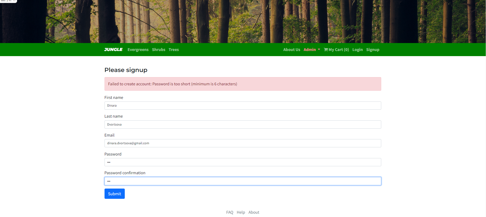
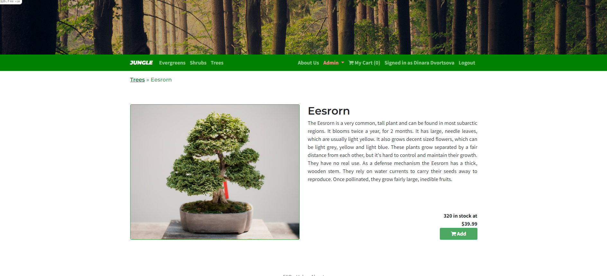
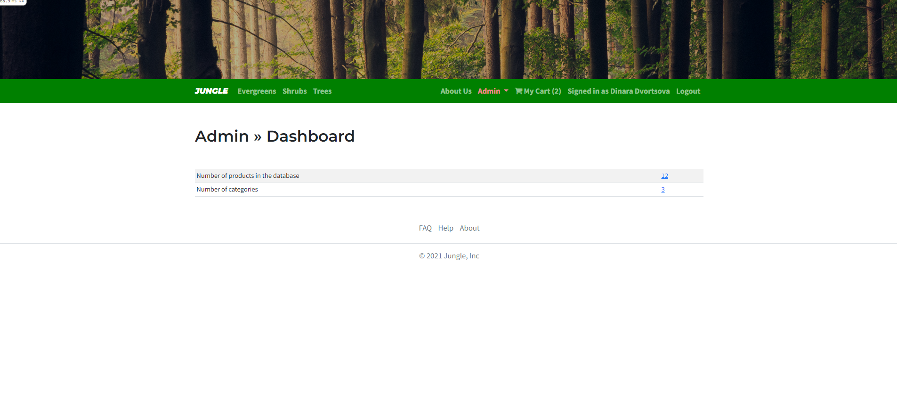
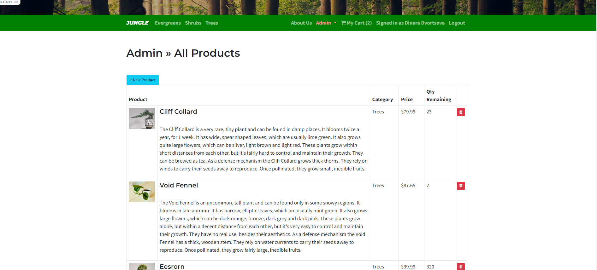
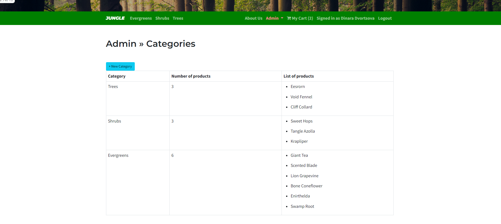
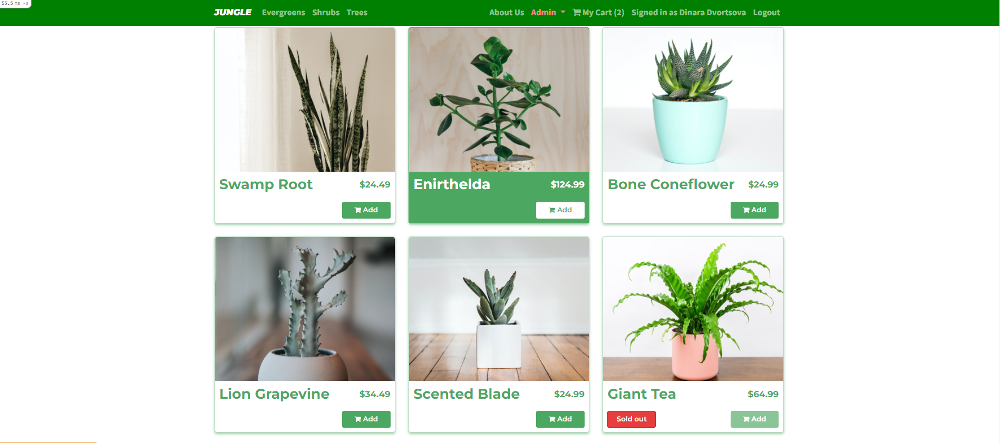

# Jungle

A mini e-commerce application built with Rails 6.1.

## Final Product

Home page

Sign up page with error

Product page

Admin Dashboard Page

Admin All Products

Admin Categories

Sold out badge

## Features
* Users can sign up or log in.
* Users can see all products in the inventory.
* Users can search for products by category.
* Users can click on a product to view more details.
* Users can add products to the cart and remove them.
* Stripe integration: Users can pay for products using a credit card.
* Admins can view, add, and delete all products.
* Admins can view, add, and delete all categories.
* Admins can view the number of products and categories on a dashboard, and access all products and all categories pages by clicking the number.

## Setup

1. Run `bundle install` to install dependencies
2. Create `config/database.yml` by copying `config/database.example.yml`
3. Create `config/secrets.yml` by copying `config/secrets.example.yml`
4. Run `bin/rails db:reset` to create, load and seed db
5. Create .env file based on .env.example
6. Sign up for a Stripe account
7. Put Stripe (test) keys into appropriate .env vars
8. Run `bin/rails s -b 0.0.0.0` to start the server

## Database

If Rails is complaining about authentication to the database, uncomment the user and password fields from `config/database.yml` in the development and test sections, and replace if necessary the user and password `development` to an existing database user.

## Stripe Testing

Use Credit Card # 4111 1111 1111 1111 for testing success scenarios.

More information in their docs: <https://stripe.com/docs/testing#cards>

## Dependencies

- Rails 6.1 [Rails Guide](http://guides.rubyonrails.org/v6.1/)
- Bootstrap 5
- PostgreSQL 9.x
- Stripe
